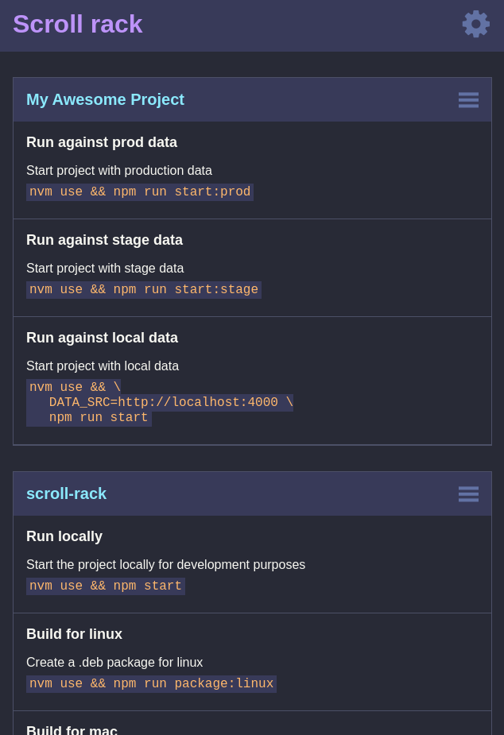
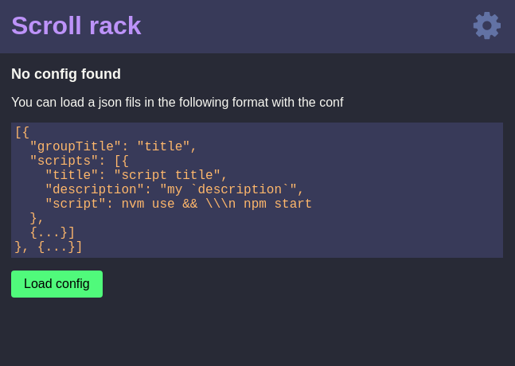

# Scroll rack

Scroll rack is a tool for easy storage and access to your own collection of scripts.
Simply load a json config, as described further down, once loaded to the app click on which ever script you wisth to add to your clipboard.

There are two .zip archives with the Mac and Linux app respectivly available in the release on github. To build the apps yourself follow the instructions [here](#Run-locally-as-a-developer).



---

## How to use
> A user interface is like a joke; If you have to explain it, it is not that good.
So here is the explanation of how to use this app.

### Load a config
The first time you open the app it will not contain any scripts but instead some instructions on how to load your first config.   
    


Create a .json file in the following format with the scripts you want or use [the scroll rack example](./docs/scroll-rack-config.json) as a base.

```json
[{
    "groupTitle": "Project name",
    "scripts": [
        {
            "title": "Script name",
            "description": "Script `description`",
            "script": "my-script \\\n with-multi-line-support"
        },
        { ... }
    ]
}, { ... }]

```

### Copy a script to clipboard
1. Click on the title of your project to open the script drawer.
2. Click on the script you wish to copy to your clipboard.

### Update your scripts
1. Via the settings menu, cogwheel in the top right corner, you can export your current config as a json file by clicking "Export config".
2. You can then modify the config as you wish.
3. Load the script into Scroll rack from the "Load config" in the settings menu.

---

## Data storage
The config you load to Scroll rack will be stored according to the `userData` path in `electron.app.getPath('userData')` described [here](https://www.electronjs.org/docs/api/app#appgetpathname).    
    
`%APPDATA%\scroll-rack\scroll-rack-config.json` on Windows    
`~/.config/scroll-rack/scroll-rack-config.json` on Linux    
`~/Library/Application\ Support/scroll-rack/scroll-rack-config.json` on macOS    

---

## Run locally as a developer
Before you run it locally you need to install the dependencies, do so by running   
`npm install`    
    
To start the project locally simply run   
`npm start`
    
To build the project for Mac run    
`npm run package:mac`   
    
To build the project for Linux run    
`npm run package:linux`   
    
To build the project for Windows run (not yet tested)    
`npm run package:win`   
    